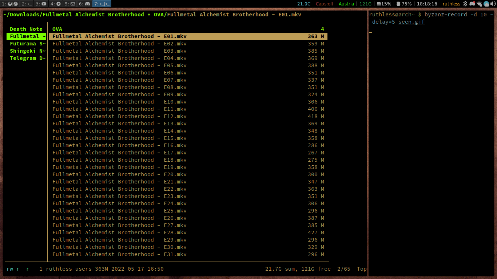

# ranger-seen

I previously saw similair functionality in KODI, 
and decided I need this luxury in my life again, 
so I made something similair in python.

## Usage

You can toggle with a key of your choice, mine was .s
All you have to do is highlight the file in ranger
and press the key combo to toggle seen/unseen.

## Installation:

Place the ranger-seen.py somewhere out of way,
and add the next line in your ~/.config/ranger/rc.conf

> map .s shell python path/to/ranger-seen.py -d %d -f %f

make sure to change the path and keybinding to your liking.

## Demo

